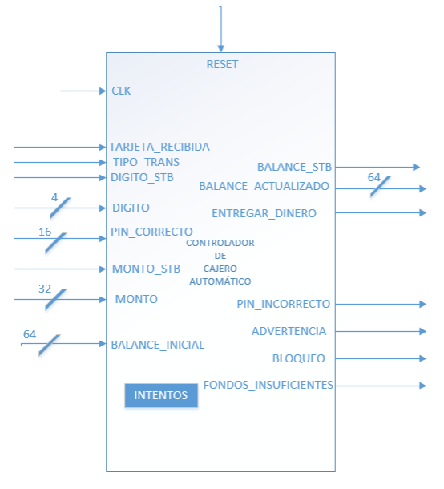
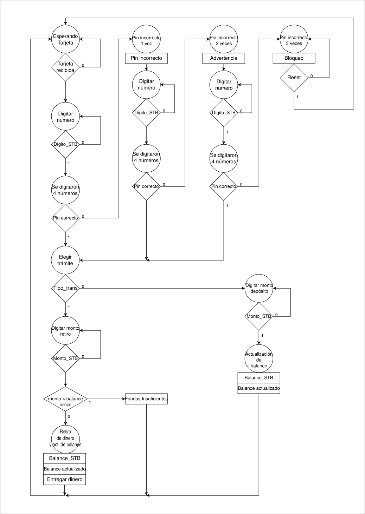

# Diseño conductual del cajero automático

En esta tarea se realiza el diseño de un controlador para un cajero automático, el cual va a poder realizar retiros y depósitos, además de tener las funcionalidades de un cajero, como lo son recibir un pin ingresado por el usuario y verificar que este sea el correcto, si se falla el pin 3 veces el cajero entrará en un estado de bloqueo y además también en un retiro verificará si el balance inicial de la cuenta es mayor que el monto, ya que si el monto es mayor que el balance inicial se debe de activar una salida llamada fondos insuficientes. 

## Diseño arquitectónico

A la hora de realizar el diseño se utilizó el siguiente diagrama de bloques:

<p align="center">
  
</p>

Además, el diagrama ASM del controlador:

<p align="center">
  
</p>

En la colocación del código, se colocaron los siguientes estados:

| Nombre del estado | Número asignado al estado |
| :---------------- | :-----------------------: |
| Esperando Tarjeta | 0 |
| Digitar número | 1 |
| Se digitaron 4 números | 2 |
| Elegir trámite | 3 |
| Digitar monto retiro | 4 |
| Digitar monto depósito | 5 |
| Actualización balance | 6 |
| Actualización balance retiro | 7 |
| Pin incorrecto 1 vez | 8 |
| Pin incorrecto 2 veces | 9 |
| Pin incorrecto 3 veces | 10 |

*Tabla 1: Estados y su número asignado en el código de Verilog.*

## Instrucciones para poder utilizar la simulación en donde se reflejan las pruebas realizadas

Para poder ejecutar la simulación se presentará a continuación la manera de poder ejecutarlo desde la terminal en linux. Para esto primero se debe de descargar los archivos nombrados como controlador.v, tester.v, testbench.v y Makefile, esto debido a que se necesitan los 4 archivos para poder ejecutar la simulación, porque en el controlador.v esta el código del controlador, en tester.v está toda la información de valores que toman las señales que entran al controlador y el tiempo en donde se activan las señales, el testbench.v que es donde se conecta al controlador con el tester y por último el archivo Makefile que será el encargado de realizar la simulación.

```bash
git clone https://github.com/jmnzzz210/IE0523
cd IE0523
cd src 
cd Tarea1
make
```
A continuación se encuentra el reporte, en donde se puede encontrar el plan de pruebas y los resultados que se obtuvieron
<a href="https://jmnzzz210.github.io/IE0523/Tarea1/docs/reporte.pdf" target="_blank">
   Reporte descripción conductual cajero automático
</a>


