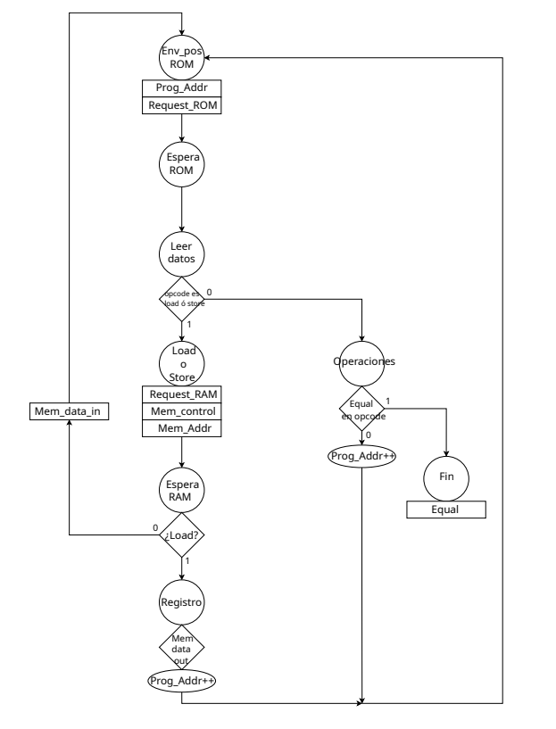

# Diseño de un controlador para CPU
---

En esta tarea se realizó un pequeño controlador de CPU, el cual solamente puede realizar operaciones de:

- Guardar
- Cargar
- Sumar
- Restar
- AND
- OR
- Igual

Para esta tarea también se cuenta con 2 módulos apartes del controlador, los cuales son la ROM y la RAM. En donde la ROM contiene instrucciones asignadas por números, estos números los envía la CPU, estas instrucciones además contienen el OPCODE, que con base a esto es que se decide si se desea una suma, un guardado o cargar un valor, y en la RAM es donde se encuentran los valores que se cargan y los valores que se guardan, finalmente en el controlador se realiza la operación deseada.
El OPCODE de las operaciones se encuentran en la tabla 1.

| OPERACIÓN | OPCODE |
|--------------|--------------|
| Guardar      | 0x4      |
| Cargar      | 0x3      |
| Sumar      | 0x9      |
| Restar      | 0xA      |
| AND      | 0x2      |
| OR      | 0x1      |
| Igual      | 0x5      |

<small><em>Tabla 1: OPCODE de las operaciones.</em></small>

## Diseño arquitecetónico

En la figura 1 se presenta el diagrama asm de la máquina de estados realizada para este controlador.

<div align="center">
  


*Figura 1: Diagrama asm del controlador para CPU*
  
</div>

Los estados y su numeración se encuentran en la tabla 2.

| Nombre del estado | Número asignado al estado |
| :--- | :--- |
| Env pos ROM | 0 |
| Espera ROM | 1 |
| Leer datos | 2 |
| Load o Store | 3 |
| Espera RAM | 4 |
| Registro | 5 |
| Operaciones | 6 |
| Fin | 7 |

<small><em>Tabla 2: Estados y su número asignado en el código de verilog</em></small>


## Instrucciones para ejecutar el controlador

Para poder obtener los resultados al compilar este diseño, se realizó un makefile, el cual realiza todo el trabajo, además de que este también realiza la síntesis, además de que en el `testbench.v` se encuentran en donde se unen los 4 módulos, el tester, la RAM, la ROM y el cpu, por lo que para ejecutar este trabajo se coloca en la terminal:

```bash
git clone https://github.com/jmnzzz210/IE0523
cd IE0523
cd Tarea3 
cd src
make
```


## Plan de pruebas
Para observar el plan de pruebas y los resultados que se obtuvieron sin ejecutar el proyecto, todo esto se puede observar en el respectivo reporte de este trabajo, el cual se encuentra <a href="https://jmnzzz210.github.io/IE0523/Tarea3/docs/reporte.pdf" target="_blank">aquí</a>.

